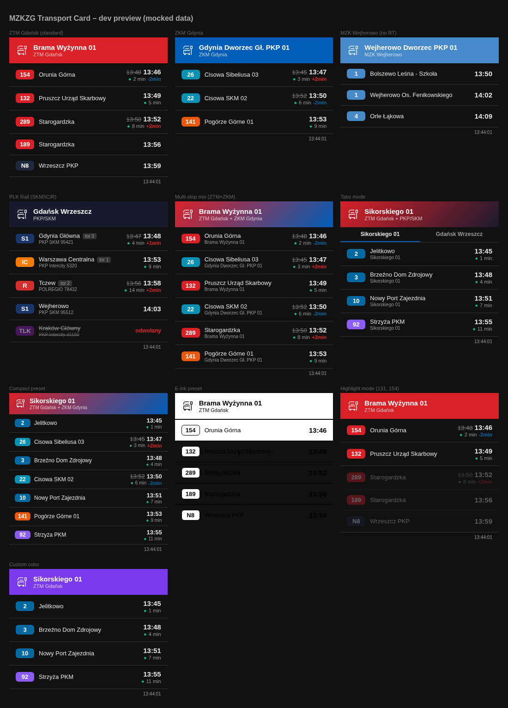

# MZKZG Transport Card

Unified real-time departure board for **Tricity (Gdańsk, Gdynia, Sopot)** and surrounding area in Home Assistant.



---

## Table of Contents

- [Features](#features)
- [Installation](#installation)
- [Integration Setup](#integration-setup)
  - [Providers](#providers)
  - [PLK API Key](#plk-api-key)
  - [Rate Limits](#rate-limits)
- [Card Configuration](#card-configuration)
  - [Options Reference](#options-reference)
  - [Display Presets](#display-presets)
  - [View Modes](#view-modes)
  - [Filtering](#filtering)
  - [Header Color](#header-color)
- [Automations](#automations)
- [Architecture](#architecture)
  - [Integration Backend](#integration-backend)
  - [Coordinator Details](#coordinator-details)
  - [Card Frontend](#card-frontend)
- [Limitations](#limitations)
- [Data Sources & Licenses](#data-sources--licenses)
- [Development](#development)

---

## Features

- 🚌 **4 providers**: ZTM Gdańsk, ZKM Gdynia, MZK Wejherowo, PKP/SKM/PR
- 🚆 **Rail**: SKM S1/S2/S3, Polregio, IC/TLK/EIC — delays, platform, train number, route timeline
- 🔀 **Multi-stop mixing** — multiple sensors on one card, sorted chronologically
- 🎨 **Smart header** — auto color per provider, gradient for mixed, or custom via color picker
- ⏱ **Time display** — departure time + countdown, strikethrough original when delayed
- ❌ **Cancelled trains** — clearly marked with red text
- 🚉 **Platform/track** — shown for rail departures
- 🔍 **Filters** — by route, by destination, highlight mode
- 📊 **3 presets**: Standard, Compact, E-ink (minimal, no dynamic data)
- 📑 **Tabs mode** — switch between stops in one card
- 🔔 **Binary sensor** — automation trigger on delays ≥ 3 min
- 📦 **One HACS install** — integration + card auto-registered
- 🌐 **Localization** — English + Polish

---

## Installation

### HACS (recommended)

1. Add this repository as a custom repository in HACS (type: **Integration**)
2. Install "MZKZG Transport"
3. Restart Home Assistant
4. The Lovelace card is auto-registered — no manual resource needed

### Manual

1. Copy `custom_components/mzkzg_transport/` to your HA `config/custom_components/`
2. Restart Home Assistant
3. Card JS is served automatically by the integration

---

## Integration Setup

### Providers

| Provider | Operator | Data | Realtime | API Key |
|----------|----------|------|----------|---------|
| `ztm_gdansk` | ZTM Gdańsk | Bus + Tram | ✅ | No |
| `zkm_gdynia` | ZKM Gdynia | Bus + Trolleybus | ✅ | No |
| `mzk_wejherowo` | MZK Wejherowo | Bus | ❌ Schedule | No |
| `plk_rail` | PKP PLK | SKM, PR, IC, TLK, EIC | ✅ | **Yes** |

### Adding a stop

1. **Settings → Devices & Services → Add Integration → MZKZG Transport**
2. Select provider
3. For PLK: enter API key + select usage tier
4. Search and select stop from the list (or type ID manually)

Each stop creates:
- `sensor.mzkzg_{provider}_{stop_id}` — departure data
- `binary_sensor.mzkzg_{provider}_{stop_id}_delay` — delay alert

### PLK API Key

1. Register at [dane.plk-sa.pl](https://dane.plk-sa.pl)
2. Create an application, get your API key
3. Enter during first PLK stop setup (stored globally, reused for subsequent stops)

### Rate Limits

PLK API has rate limits. The integration adjusts refresh interval based on your tier:

| Tier | Hourly limit | Daily limit | Refresh interval |
|------|-------------|-------------|-----------------|
| Basic | 100 | 1,000 | 180s |
| Standard | 500 | 5,000 | 120s |
| Premium | 2,000 | 20,000 | 60s |

Other providers (ZTM, ZKM, MZK) have no rate limits. Default refresh: 30s.

If PLK rate limit is hit, the card shows "PLK API: przekroczono limit zapytań" and retries automatically.

---

## Card Configuration

```yaml
type: custom:mzkzg-transport-card
entities:
  - sensor.mzkzg_ztm_2218
  - sensor.mzkzg_plk_7534
title: Sikorskiego + SKM
max_departures: 10
display_preset: standard
view_mode: mixed
header_color: "#DA2128"
filter_routes:
  - "2"
  - "S1"
destination_filter:
  - "Wrzeszcz"
highlight_mode: false
show_delays: true
hide_terminus: true
realtime_only: false
show_footer: true
```

### Options Reference

| Option | Default | Description |
|--------|---------|-------------|
| `entities` | — | Sensor entity IDs (required) |
| `title` | auto | Card title (auto from stop name) |
| `header_color` | auto | CSS color or empty for auto-detection |
| `max_departures` | 10 | Number of departures shown (3–20) |
| `display_preset` | standard | `standard` / `compact` / `e_ink` |
| `view_mode` | mixed | `mixed` (chronological) / `tabs` (per stop) |
| `filter_routes` | — | Show only these routes |
| `destination_filter` | — | Show only these destinations (partial match) |
| `highlight_mode` | false | Dim non-matching instead of hiding |
| `show_delays` | true | Show delay info (+Xmin) |
| `hide_terminus` | true | Hide trips ending at this stop |
| `realtime_only` | false | Hide schedule-only departures |
| `show_footer` | true | Show last update timestamp |

### Display Presets

| Preset | Use case | Shows |
|--------|----------|-------|
| **Standard** | Daily dashboard | Full info: time, countdown, delays, stop name, platform |
| **Compact** | Small panels | Smaller rows, no stop names |
| **E-ink** | E-ink displays | Only route + headsign + time HH:MM. No dynamic data. |

### View Modes

- **Mixed** — all departures from all entities sorted by time. Auto-shows stop name under each departure.
- **Tabs** — tab bar with stop names. Click to switch. Only shows departures from active tab.

### Filtering

- **Route filter** — comma-separated route numbers (e.g., `131, S1, IC`). Only matching shown.
- **Destination filter** — comma-separated keywords (e.g., `Wrzeszcz, Oliwa`). Partial match on headsign.
- **Highlight mode** — when enabled with route filter, non-matching routes are dimmed (opacity 35%) instead of hidden.

### Header Color

Auto-detected from providers:

| Provider | Color |
|----------|-------|
| ZTM Gdańsk | Red `#DA2128` |
| ZKM Gdynia | Blue `#005eb8` |
| MZK Wejherowo | Light blue `#478AC9` |
| PLK Rail | Dark navy `#1a1a2e` |
| Mixed (different providers) | Gradient between colors |
| Mixed (same provider) | Solid color |

Override with `header_color` in config or via the color picker in the visual editor.

### Route Badge Colors

**ZTM Gdańsk:**
- Tram 1–15: Blue
- Tram 60–69 (seasonal): Amber
- Tram 90–99 (special): Purple
- Bus: Red
- Night (N*): Dark

**ZKM Gdynia:**
- Trolleybus 20–29: Cyan
- Bus: Orange

**PLK Rail:**
- S1/S2/S3 (SKM): Navy
- IC: Orange
- EIC/EIP: Dark navy
- TLK: Purple
- R/RE/PKM (Polregio): Red

---

## Automations

Each stop creates a binary sensor that turns ON when any departure is delayed ≥ 3 minutes.

```yaml
automation:
  - alias: "Tram delay notification"
    trigger:
      - platform: state
        entity_id: binary_sensor.mzkzg_ztm_2218_delay
        to: "on"
    action:
      - service: notify.mobile_app
        data:
          title: "Opóźnienie tramwaju"
          message: >
            
            
            {{ d.route }} → {{ d.headsign }}: +{{ d.delay_minutes }} min
            
```

Binary sensor attributes:
- `delayed_departures` — list of `{route, headsign, delay_minutes}`
- `threshold_minutes` — current threshold (3)

---

## Architecture

### Integration Backend

```
custom_components/mzkzg_transport/
├── __init__.py          # Entry setup, shared coordinator, card registration
├── const.py             # URLs, provider constants, PLK tier intervals
├── coordinator.py       # DataUpdateCoordinator — fetches from all 4 APIs
├── config_flow.py       # Multi-step UI flow (provider → api_key → stop select)
├── sensor.py            # Departure sensor entity
├── binary_sensor.py     # Delay alert entity
├── gtfs_provider.py     # GTFS parser for MZK Wejherowo (cached to disk)
├── strings.json         # Default strings
├── translations/        # en.json, pl.json
├── manifest.json        # HA integration metadata
└── www/
    └── mzkzg-transport-card.js  # Bundled Lovelace card
```

### Coordinator Details

One `MzkzgTransportCoordinator` per config entry (shared between sensor + binary_sensor):

| Provider | API | Refresh | Method |
|----------|-----|---------|--------|
| ZTM Gdańsk | `ckan2.multimediagdansk.pl/departures` | 30s | REST, realtime |
| ZKM Gdynia | `api.zdiz.gdynia.pl/pt/delays` + `/pt/routes` | 30s | REST, realtime |
| MZK Wejherowo | `mkuran.pl/gtfs/wejherowo.zip` | 30s (GTFS refreshed daily) | Static GTFS parse |
| PLK Rail | `pdp-api.plk-sa.pl/api/v1/operations` + `/schedules` | 60–180s (tier) | REST, realtime + schedule |

Uses HA's shared `aiohttp` session (no private sessions, no leaks).

### Card Frontend

- Pure vanilla JS, no build step, no dependencies
- Shadow DOM isolation
- Reads data from `hass.states[entity].attributes.departures`
- Auto-registered via `add_extra_js_url` (no manual resource config)
- Visual editor with context-aware options

---

## Limitations

| Limitation | Reason |
|-----------|--------|
| No bike/wheelchair/AC icons | APIs don't return vehicle feature data |
| PLK rate limits | Free tier = 1000 req/day. Adjust tier in config. |
| MZK Wejherowo no realtime | Only static GTFS available, no RT feed |
| PLK route timeline only | ZTM/ZKM don't expose per-trip route data in departure endpoints |
| Entity IDs fixed after creation | HA doesn't rename entity_id. Delete + re-add to get new format. |
| GTFS cache on disk | Stored in integration directory. First load downloads ~1MB zip. |

---

## Data Sources & Licenses

| Provider | Source | License |
|----------|--------|---------|
| ZTM Gdańsk | [TRISTAR / Otwarty Gdańsk](https://ckan.multimediagdansk.pl) | CC-BY 4.0 |
| ZKM Gdynia | [ZDiZ Gdynia Open Data](https://api.zdiz.gdynia.pl) | CC-BY 4.0 |
| MZK Wejherowo | [GTFS by Mikołaj Kuranowski](https://mkuran.pl/gtfs/) | Public domain |
| PKP/SKM/PR | [PLK OpenData](https://dane.plk-sa.pl) | Custom (free, key required) |

---

## Development

```bash
# Run dev preview (mocked data)
node dev/server.cjs
# Open http://localhost:8095

# Run tests
pip install pytest pytest-asyncio aiohttp aioresponses homeassistant
python -m pytest tests/ -v

# Run with coverage
python -m pytest tests/ --cov=mzkzg_transport --cov-report=term-missing

# Docker HA for live testing
docker run -d --name ha-mzkzg-test -p 8123:8123 \
  -v ./custom_components/mzkzg_transport:/config/custom_components/mzkzg_transport \
  -v ./mzkzg-transport-card.js:/config/www/mzkzg-transport-card.js \
  ghcr.io/home-assistant/home-assistant:stable
```

---

## License

MIT

---

Made with ❤️ by **Tomasz Toczek** ([@toczke](https://github.com/toczke)) with assistance from **Kiro** (powered by Claude, Anthropic).
