# MZKZG Transport Card

Real-time departure board for Tricity (Gdańsk, Gdynia, Sopot) and surrounding area public transport in Home Assistant. Integration + Lovelace card.

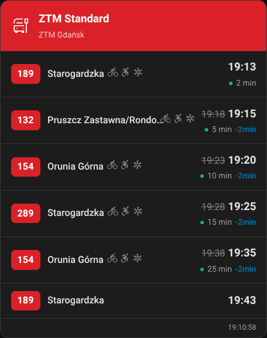

## Supported operators

| Operator | Data source | Realtime |
|----------|-------------|----------|
| **ZTM Gdańsk** | TRISTAR API + vehicle fleet DB | ✅ delays, vehicle capabilities |
| **ZKM Gdynia** | ZDiZ API | ✅ delays |
| **MZK Wejherowo** | Static GTFS | ❌ schedule only |
| **PKP/SKM/Polregio** | PLK OpenData API | ✅ delays, platform, track |

## Installation

### HACS (recommended)
1. Add custom repository: `https://github.com/toczke/mzkzg-transport-card`
2. Install "MZKZG Transport"
3. Restart Home Assistant

### Manual
1. Copy `custom_components/mzkzg_transport/` to your HA config directory
2. Restart Home Assistant

## Integration setup

Settings → Devices & Services → Add Integration → **MZKZG Transport**

Select a provider, pick a stop, done.

### PKP/PLK API key

For railway data (PKP, SKM, Polregio, IC), you need a free API key from PLK OpenData:

1. Go to [https://dane.plk-sa.pl](https://dane.plk-sa.pl)
2. Create an account (free registration)
3. Navigate to **API** → **Klucze API** (API Keys)
4. Generate a new key (tier "basic" gives 100 requests/hour — sufficient for up to 4 stations)
5. Copy the key and paste it during integration setup

The integration automatically manages rate limits based on your tier and number of configured stations.

## Lovelace card

The card registers automatically. Add via UI: **Add Card → MZKZG Transport Card**.

All options are available in the visual editor.

### Configuration options

| Option | Description | Default |
|--------|-------------|---------|
| `entities` | Sensor entity list | required |
| `title` | Card title | auto from stop name |
| `display_preset` | `standard` / `compact` / `e_ink` | `standard` |
| `view_mode` | `mixed` / `tabs` (multi-entity) | `mixed` |
| `max_departures` | Max departures shown (3-20) | 10 |
| `header_color` | Header color (hex) | auto from provider |
| `filter_routes` | Show only these routes | none |
| `destination_filter` | Filter by destination | none |
| `filter_platform` | Filter by platform number | none |
| `filter_track` | Filter by track number | none |
| `highlight_mode` | Dim non-matching instead of hiding | `false` |
| `hide_terminus` | Hide departures ending at this stop | `true` |
| `realtime_only` | Show only realtime departures | `false` |
| `show_delays` | Show delay information | `true` |
| `show_footer` | Show last update time | `true` |
| `show_bike` | Show bike rack icon | `true` |
| `show_wheelchair` | Show wheelchair ramp icon | `true` |
| `show_ac` | Show air conditioning icon | `true` |
| `show_ticket_machine` | Show ticket machine icon | `true` |
| `refresh_interval` | Countdown refresh interval (seconds) | 60 |

## Gallery

<strong>ZTM Gdańsk — Standard</strong>

<strong>ZKM Gdynia — Standard</strong>

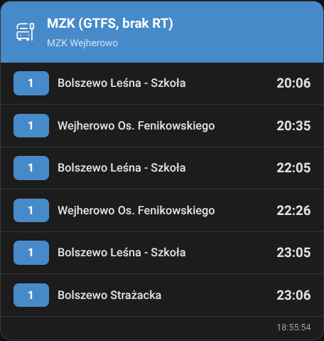

<strong>MZK Wejherowo — Static GTFS</strong>

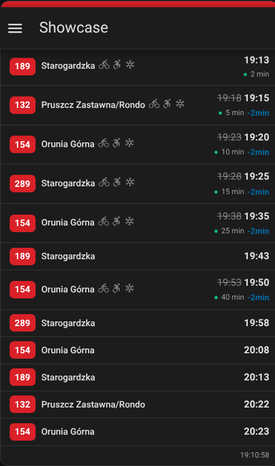

<strong>PKP/SKM — Railway with platform & track</strong>

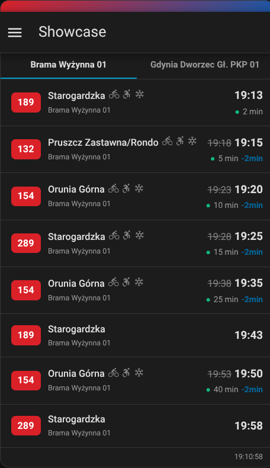

<strong>Preset: Compact</strong>

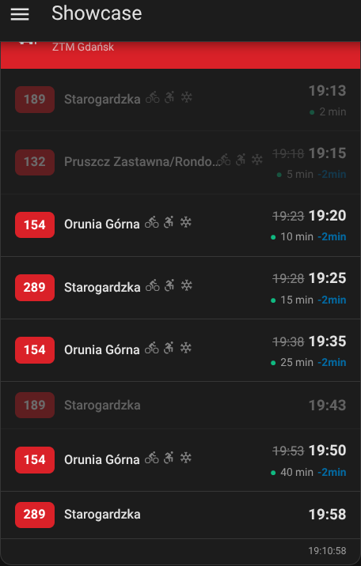

<strong>Preset: E-ink</strong>

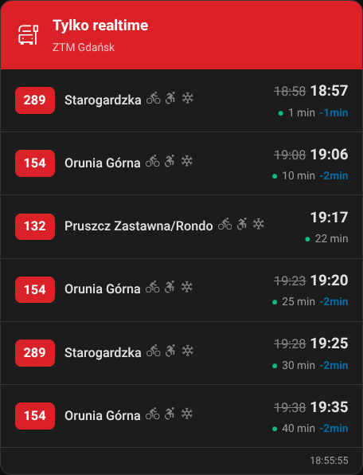

<strong>Multi-provider — mixed view</strong>

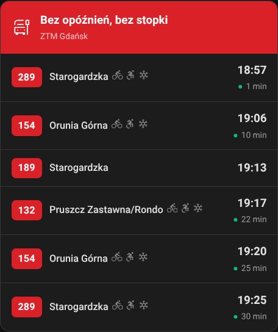

<strong>Multi-provider — tabs</strong>

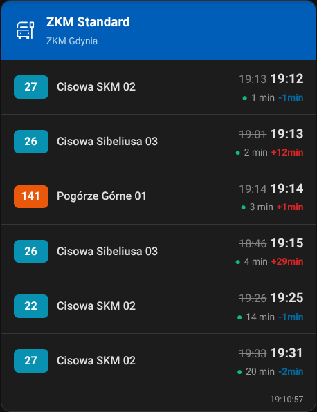

<strong>Route filter</strong>

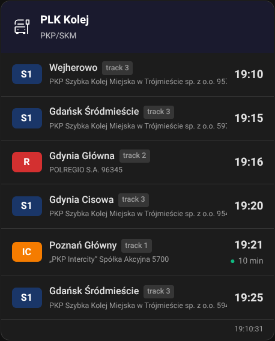

<strong>Highlight mode</strong>

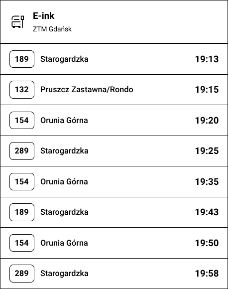

<strong>Destination filter</strong>

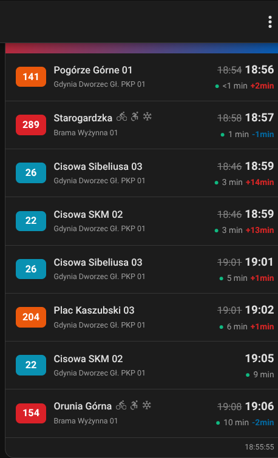

<strong>Realtime only</strong>

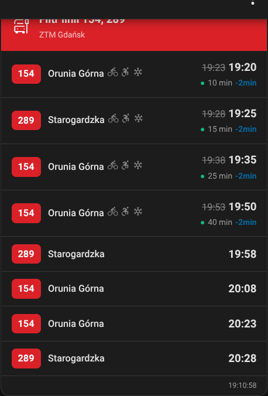

<strong>Custom header color</strong>

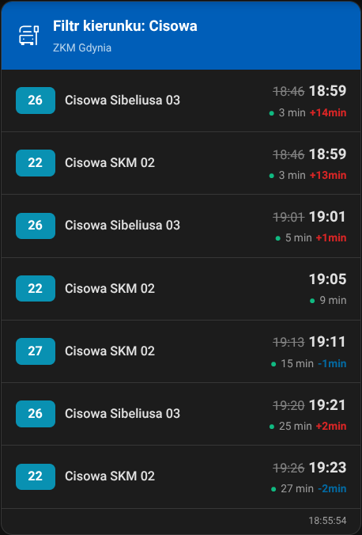

<strong>No delays, no footer</strong>

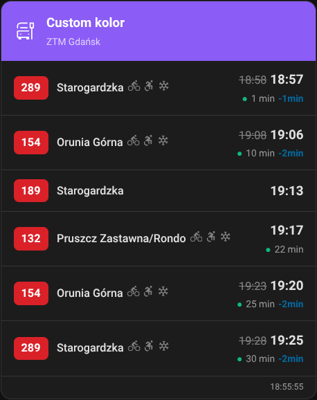

## Vehicle capabilities (ZTM Gdańsk)

The card automatically fetches the ZTM vehicle fleet database and displays icons for the actual vehicle serving each departure:

- 🚲 Bike rack
- ♿ Wheelchair ramp
- ❄️ Air conditioning
- 🔌 USB charging
- 🎫 Ticket machine

Fleet data is refreshed every 7 days.

## PLK rate limiting

The integration dynamically calculates refresh intervals based on:
- API tier (basic: 100 req/h, standard: 500, premium: 2000)
- Number of configured stations

Schedule data is cached for the entire day. Realtime data is polled at safe intervals that never exceed your tier limit.

## Changelog

### 1.1.0
- Vehicle capabilities from ZTM fleet database (bike, wheelchair, AC, USB, ticket machine)
- Vehicle number display
- PLK: platform and track as chips
- Filter by platform/track
- Dynamic PLK rate limiting
- Visual editor: all options available
- Fix: editor focus loss
- Fix: e-ink preset no longer resets settings
- HA 2026.3+ compliance (brand/, device_info, async_unload)

### 1.0.0
- Initial release
- ZTM, ZKM, MZK, PLK providers
- Presets: standard, compact, e-ink
- Filtering, highlight, tabs

## License

MIT
