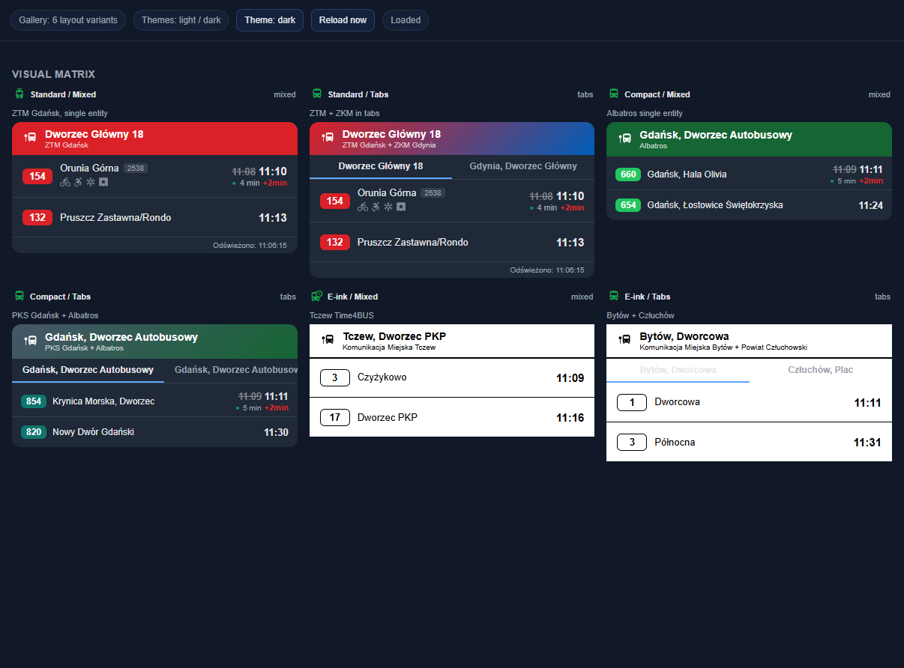
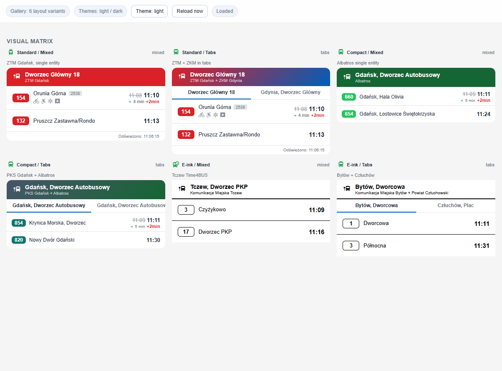

# MZKZG Transport Card

[](https://github.com/hacs/integration)
[](https://github.com/toczke/mzkzg-transport-card/releases)
[](LICENSE)
[](#testing)

Home Assistant integration + Lovelace card for real-time departures in Tricity and nearby operators.




## Visual Gallery

The gallery below shows the main card layout combinations:

- `standard`, `compact`, `e_ink`
- `mixed`, `tabs`
- `light`, `dark`

Open the standalone gallery locally at `dev/gallery.html`.


## Features

- Multi-provider departures (bus, tram, trolleybus, rail)
- Visual editor (no YAML required)
- Per-sensor filters in multi-sensor cards
- Route, destination, platform and track filtering
- Vehicle capabilities (bike, wheelchair, AC, USB, ticket machine where available)
- Side number (`numer boczny`) for providers that expose it
- Realtime delay rendering with animated live dot
- Row actions: `tap_action`, `hold_action`, `double_tap_action`
- Accessibility: keyboard focus, ARIA labels, reduced-motion support
- PLK dynamic rate limiting + API usage sensor

## Supported Operators

| Operator | Coverage | Realtime | Capabilities |
|---|---|---|---|
| ZTM Gdańsk | Buses and trams in Gdańsk area | Yes | bike, wheelchair, AC, USB, ticket machine, side number |
| ZKM Gdynia | Buses and trolleybuses in Gdynia | Yes | side number (+ bike/wheelchair/AC when API provides) |
| MZK Wejherowo | Buses in Wejherowo area | Schedule only | no live capability metadata |
| Tczew (Time4BUS) | Bus departures with live → schedule fallback | Yes | side number (+ wheelchair/AC/ticket machine if provided) |
| kiedyPrzyjedzie carriers | PKS/municipal bus carriers | Yes | bike/wheelchair/AC/ticket machine from `vehicle_attributes` |
| PKP / SKM / Polregio / IC (PLK) | Railway stations via PLK API | Yes | platform, track, carrier, train number, cancellation |

## Installation

### HACS

1. HACS → Integrations → Custom repositories
2. Add `https://github.com/toczke/mzkzg-transport-card` as **Integration**
3. Install **MZKZG Transport**
4. Restart Home Assistant

### Manual

```bash
cp -r custom_components/mzkzg_transport/ /config/custom_components/
```

Restart Home Assistant.

## Setup

Add integration: **Settings → Devices & Services → Add Integration → MZKZG Transport**.

For PLK provider, add API key from `https://pdp-api.plk-sa.pl`.

## Card Configuration

Add card: **Add Card → MZKZG Transport Card**.

If card does not appear in picker, add resource manually:

- URL: `/mzkzg_transport/mzkzg-transport-card.js`
- Type: `JavaScript module`

### Main Options

| Option | Description | Default |
|---|---|---|
| `entities` | Sensor entities (`string` or object with per-sensor overrides) | required |
| `display_preset` | `standard` / `compact` / `e_ink` | `standard` |
| `view_mode` | `mixed` / `tabs` | `mixed` |
| `max_departures` | Max rows (3–20) | `10` |
| `filter_routes` | Route filter | — |
| `destination_filter` | Destination filter | — |
| `filter_platform` | Platform filter | — |
| `filter_track` | Track filter | — |
| `highlight_mode` | Dim instead of hide for route filter | `false` |
| `hide_terminus` | Hide departures ending at stop | `true` |
| `realtime_only` | Show only realtime | `false` |
| `tap_action` | Row tap action | `more-info` |
| `hold_action` | Row hold/right-click action | `none` |
| `double_tap_action` | Row double-tap action | `none` |

### Per-sensor overrides (entities objects)

Supported per-sensor keys:

- `filter_routes`
- `destination_filter`
- `filter_platform`
- `filter_track`
- `realtime_only`
- `hide_terminus`
- `highlight_mode`

Example:

```yaml
type: custom:mzkzg-transport-card
view_mode: mixed
entities:
  - entity: sensor.mzkzg_ztm_1327
    filter_routes: ["2", "8"]
    destination_filter: ["Wrzeszcz"]
  - entity: sensor.mzkzg_zkm_35190
    filter_routes: ["147"]
    realtime_only: true
filter_routes: ["N1"]   # fallback for sensors without local override
tap_action:
  action: more-info
```

## PLK API Usage Sensor

`sensor.*_plk_api_usage` exposes:

- `state` / `requests_total`
- `rate_limit_hits`
- `last_success`

Counters are now restored after Home Assistant restart.

## Testing

```bash
python -m pytest tests/ -v
```

Windows:

```bash
python -c "import asyncio,sys,pytest; asyncio.set_event_loop_policy(asyncio.WindowsSelectorEventLoopPolicy()); sys.exit(pytest.main(['-q']))"
```

Current test status: **36 passed, 1 skipped**.

## Local Preview (without HA release build)

You can preview all providers except PLK in a standalone page:

1. Run local static server in repo root:
   ```bash
   python -m http.server 8125
   ```
2. Open:
   `http://localhost:8125/dev/preview.html`

The preview page supports auto-reload with cache-busting, so JS card changes are visible immediately.

For the configuration gallery, open:

`http://localhost:8125/dev/gallery.html`

## Contributing

- Open an issue with provider, stop ID, steps, expected vs actual behavior.
- For code changes, include tests where possible.
- Keep both card files in sync:
  - `custom_components/mzkzg_transport/www/mzkzg-transport-card.js`
  - `mzkzg-transport-card.js`
  - You can sync with: `powershell -ExecutionPolicy Bypass -File dev/sync-card.ps1`

## Project Funding

This is a community, non-profit project.  
The maintainer does not receive monetary profit from this repository.

## License

[MIT](LICENSE) © Tomasz Toczek
